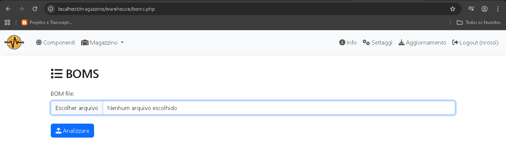

# Gestionale Magazzino Componenti Elettronici 

Questo repository contiene suggerimenti per il progetto "Gestione Magazzino" creato da Gabriele Riva.

Il primo suggerimento riguarda l'implementazione di una Distinta Materiali/Bill of Materials (BOM). 

Per utilizzarlo, è sufficiente:

1) Copiare il file *boms.php* nella cartella "xampp\htdocs\magazzino\warehouse\";

2) Accedere al sistema;

3) Nella barra degli indirizzi del browser, digitare "http://localhost/magazzino/warehouse/boms.php".
L'immagine sotto mostra l'aspetto di questa pagina:

<br>
<table align="center"><tr><td> 
<br>
<p align="center" width="100%"><b>Figure 1. Pagina BOM iniziale</b></p>
</td></tr></table>
<br>

4) Selezionare un file BOM (estensione CSV; vedere i formati supportati di seguito) e premere "Analizzare".
Apparirà un report (come nell'immagine sottostante) con una riga per ogni componenti presente 
nel file BOM. Inoltre, la colonna "Stato" indicherà se i componenti sono disponibili a 
magazzino o devono essere acquistati.

<br>
<table align="center"><tr><td> 
<br>
<p align="center" width="100%"><b>Figure 2. Pagina BOM con report</b></p>
</td></tr></table>
<br>

# BOM file formati

Come idea iniziale, ho utilizzato il formato standard KiCad per i file BOM (:

```
'Reference';'Value';'Description';'Qty'
'C1';'47uF';'Polarized capacitor';'1'
'D1';'1N5231';'Zener diode';'1'
'D2';'1N5817';'20V 1A Schottky Barrier Rectifier Diode, DO-41';'1'
'D3';'1N4148';'100V 0.15A standard switching diode, DO-35';'1'
'J1';'PicArd Connector';'Generic connector, single row, 01x06, script generated';'1'
'J2,J4';'Picard Connector';'Generic connector, single row, 01x06, script generated';'2'
'J3,J5';'PCB/Breadboard';'Generic connector, single row, 01x06, script generated';'2'
'L1';'2.2mH';'Inductor';'1'
'Q1,Q4';'BC547';'0.1A Ic, 45V Vce, Small Signal NPN Transistor, TO-92';'2'
'Q2,Q3,Q5,Q6,Q7';'BC557';'0.1A Ic, 45V Vce, PNP Small Signal Transistor, TO-92';'500'
'R1';'1k2';'Resistor';'1'
'R2,R4,R8';'4k7';'Resistor';'3'
'R3';'2k8';'Resistor';'1'
'R5,R14';'100k';'Resistor';'2'
'R6,R7,R9';'10k';'Resistor';'3'
'R10';'56';'Resistor';'1'
'R11,R12,R13';'2k2';'Resistor';'3'
'U1';'ATmega328P-U';'20MHz, 32kB Flash, 2kB SRAM, 1kB EEPROM, TQFP-32';'1'
'U2';'PIC12F675';'1024W Flash, 64B SRAM, 128B EEPROM, PDIP-8';'1'
'U3';'PIC16F819-IP';'3584B Flash, 256B SRAM, 256B EEPROM, ADC, DIP18';'1'
```

Se si desidera utilizzare un formato diverso, modificare i parametri all'interno del file *boms.php*:

```
// BOM files parametri
$bom_separator = ";";
$bom_codice_column = 1;
$bom_quantity_column = 3;

```

# Sviluppi futuri

+ Migliorare l'aspetto del report;
+ Includere una ricerca di codici componente equivalenti o simili;
+ Includere opzioni per gestire vari tipi di file BOM;
+ Aggiungere un collegamento al header file.


# Crediti e riferimenti

Questo progetto si basa sul originale di RG4Tech (Gabriele Riva).
 
Sito web del progetto: https://rg4tech.altervista.org/forum/thread-463-post-576.html


# Contact Info:

## Personal site:
https://nrbenergia.azurewebsites.net/

or

http://www.nrbenergia.somee.com/  

## LinkedIn:
https://www.linkedin.com/in/nelsonrossibittencourt/
