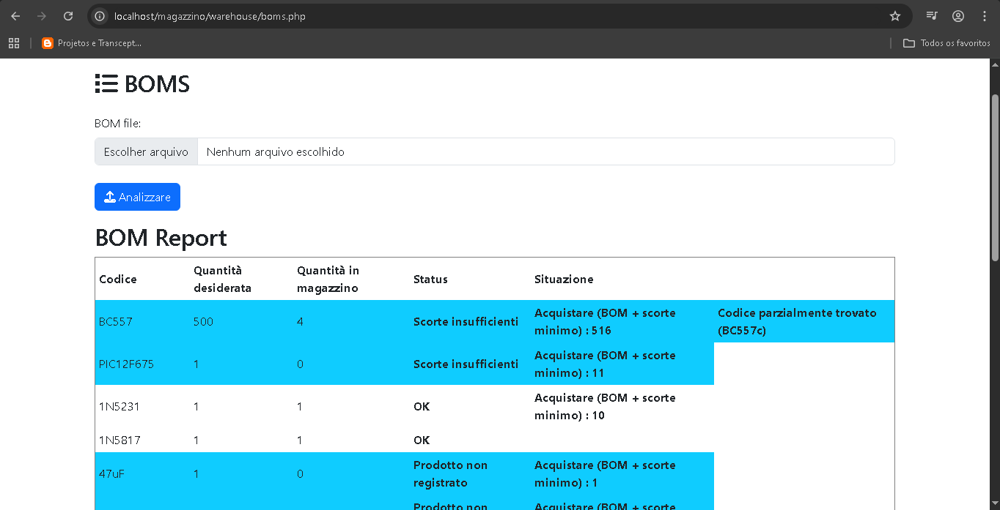
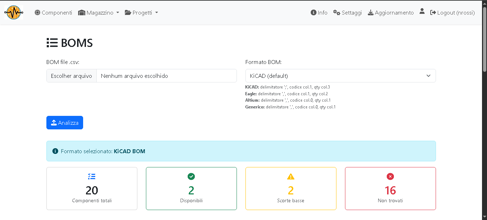
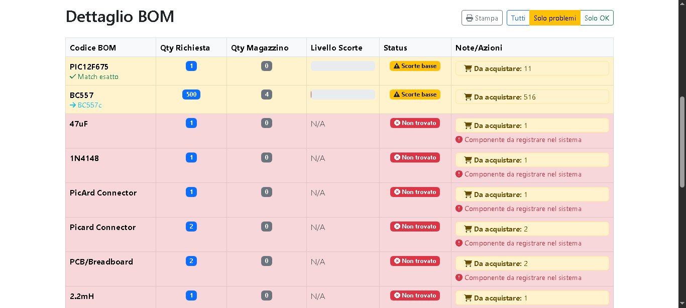

# Gestionale Magazzino Componenti Elettronici 

Questo repository contiene suggerimenti per il progetto "Gestione Magazzino" creato da Gabriele Riva.

## Suggerimento 1: Implementazione di una Distinta Materiali/Bill of Materials (BOM). 

### Versione 0.0.0

L'implementazione iniziale è stata realizzata da me e può essere visualizzata (solo a scopo storico) nel file *boms_v000.php*.

Questa versione conteneva solo il motore per confrontare gli elenchi dei componenti di un file BOM (formato Kicad) e un semplice report, come mostrato nella figura seguente:

 
<table align="center"><tr><td> 
 

<b>Figura 1. Pagina BOM con report - Versione 0.0.0</b>

</td></tr></table>
 

Inoltre, per la versione 0.0.0 l'elenco degli sviluppi futuri era:

+ Migliorare l'aspetto del report;
+ Includere una ricerca di codici componente equivalenti o simili;
+ Includere opzioni per gestire vari tipi di file BOM;
+ Aggiungere un collegamento al header file.

### Versione 0.0.1

RG4 Tech ha gentilmente aggiornato il codice alla versione 0.0.1, implementando tutti gli argomenti di sviluppo futuri precedentemente proposti.

Il codice aggiornato è contenuto nel file "boms_v001.php" (se intendete utilizzare questo file, copiatelo nella cartella "warehouse" del vostro progetto e rinominatelo in "boms.php").

RG4 Tech ha inoltre aggiornato il progetto principale come segue:

+ Aggiornamento del file "header.php" (situato nella cartella "includes"): per aggiungere il menu "Progetti" e
+ Inclusione del file "boms_print.css" (situato nella cartella "assets\css"): per ottimizzare la stampa dei report.

Il risultato è visibile nelle figure 2 e 3 sottostanti.

 
<table align="center"><tr><td> 
 

<b>Figura 2. Pagina BOM - Versione 0.0.1</b>

</td></tr></table>
 

 
<table align="center"><tr><td> 
 

<b>Figura 3. Pagina BOM (continuazione) - Versione 0.0.1</b>

</td></tr></table>
 

### Versione > 0.0.1

Vedere la sezione "Releases".

# Crediti e riferimenti

Questo progetto si basa sul originale di RG4Tech (Gabriele Riva).
 
Sito web del progetto: https://rg4tech.altervista.org/forum/thread-463-post-576.html

# Contact Info:

## Personal site:
https://nrbenergia.azurewebsites.net/

or

http://www.nrbenergia.somee.com/  

## LinkedIn:
https://www.linkedin.com/in/nelsonrossibittencourt/
